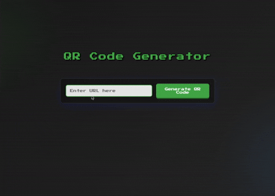

# QR Code Generator 🧾🔳

A simple and user-friendly QR Code Generator built with ❤️. This web application allows users to generate QR codes for any text or URL input and download them as image files.

---

## 📸 Live Preview

---

## ✨ Features

- 🔤 **Custom Text/URL Input** – Generate QR codes for any string or web link.  
- 🖼️ **QR Code Image Generation** – Instantly displays a scannable QR code.  
- 💾 **Download Option** – Save your QR code as a high-quality image (PNG).  
- 🎨 **Responsive UI** – Clean and modern interface that works on all screen sizes.

---

## 🚀 Getting Started

### Clone the Repository

    git clone https://github.com/RADXIshan/QR-CODE-GENERATOR.git
    cd QR-CODE-GENERATOR

### Install Dependencies

    npm install

### Start the App

    npm start

Then open your browser at: [http://localhost:3000](http://localhost:3000)

---

## 🛠️ Tech Stack

- **Frontend:** HTML, CSS, JavaScript  
- **Backend:** Node.js, Express  
- **QR Generator:** [qrcode](https://www.npmjs.com/package/qrcode)

---

## 📁 Folder Structure

    QR-CODE-GENERATOR/
    ├── public/
    │   ├── index.html
    │   ├── style.css
    │   └── index.js
    ├── assets/
    │   └── demo.gif
    ├── server.js
    ├── package.json
    ├── README.md

---

## 🙌 Contribution

Pull requests are welcome! Follow these steps:

1. Fork the repo  
2. Create a new branch: `git checkout -b feature-name`  
3. Commit your changes: `git commit -m 'Add feature'`  
4. Push to the branch: `git push origin feature-name`  
5. Open a Pull Request

---

## 📄 License

This project is licensed under the **MIT License** – see the LICENSE file for details.

---

**Made with 💻 by [@RADXIshan](https://github.com/RADXIshan)**

---
